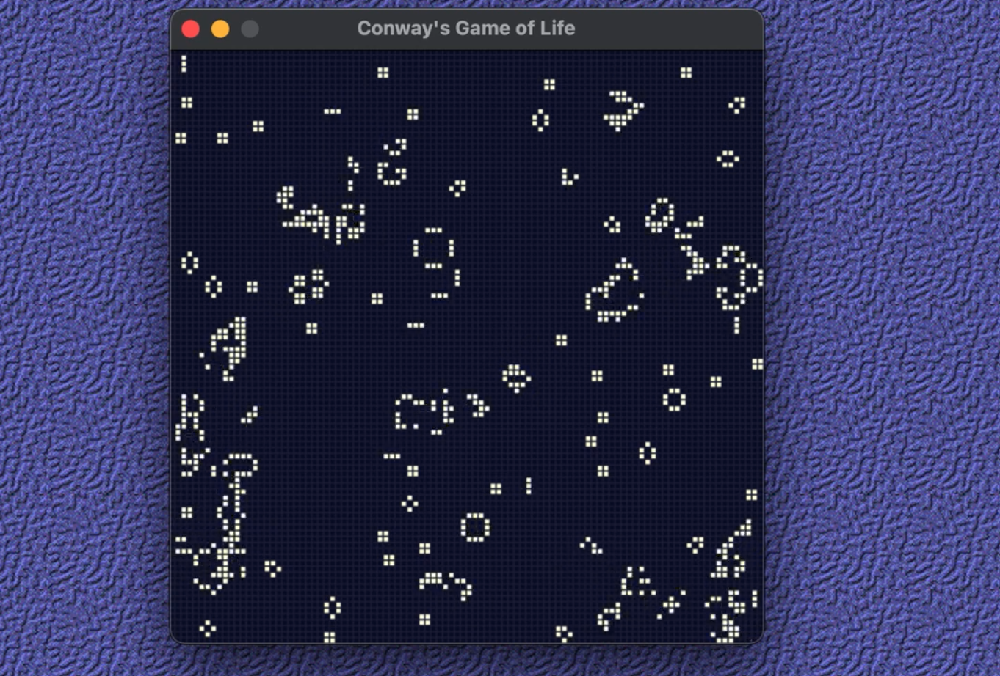

# Conway's Game of Life (CGoL)
This is a simplified version of GoL written in Python using Pygame and Numpy.
It displays a 100 by 100 grid in a Pygame widnow and plays out the GoL.

You can adjust the size and speed of the game as desired.

### Running on macOS
Python virtual environment (venv) is recommneded.
```python3 -m venv venv``` 
then
```source venv/bin/activate ```

Once you are you seen venv is running, then you can install the required libraries.
```
pip install pygame
pip install numpy
```